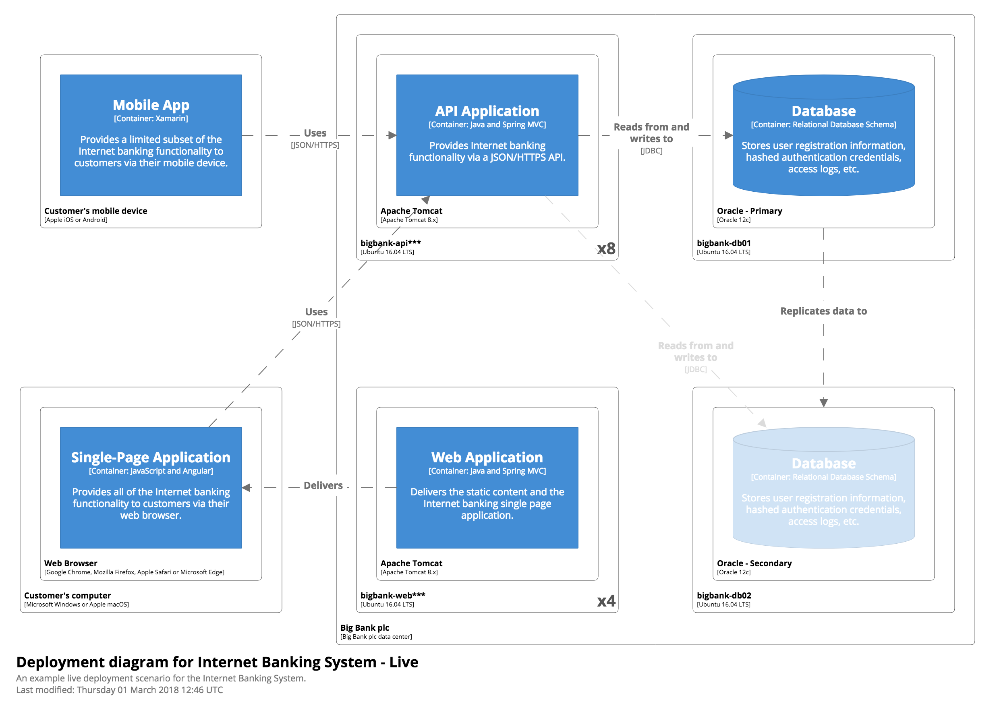

# Deployment diagram

A deployment diagram allows you to illustrate how containers in the static model are mapped to infrastructure. This deployment diagram is based upon a [UML deployment diagram](https://en.wikipedia.org/wiki/Deployment_diagram), although simplified slightly to show the mapping between containers and deployment nodes. A deployment node is something like physical infrastructure (e.g. a physical server or device), virtualised infrastructure (e.g. IaaS, PaaS, a virtual machine), containerised infrastructure (e.g. a Docker container), an execution environment (e.g. a database server, Java EE web/application server, Microsoft IIS), etc. Deployment nodes can be nested.

> Note: this page describes a feature that is not available to use with Structurizr's Free Plan. You can, however, render Deployment diagrams using the [PlantUMLWriter](plantuml.md).

## Example

As an example, a Deployment diagram for the live environment of a simplified, fictional Internet Banking System might look something like this. In summary, it shows the deployment of the Web Application and the Database, with a secondary Database being used for failover purposes.

See [BigBankPlc.java](https://github.com/structurizr/java/blob/master/structurizr-examples/src/com/structurizr/example/BigBankPlc.java) for the code, and [https://structurizr.com/share/36141#LiveDeployment](https://structurizr.com/share/36141#LiveDeployment) for the diagram.