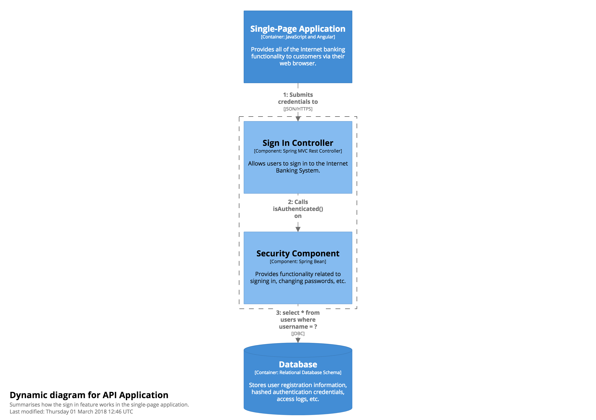

# Dynamic diagram

In addition to the diagrams showing static structure, you can also create a simple Dynamic diagram. This can be useful when you want to show how elements in a static model collaborate at runtime to implement a user story, use case, feature, etc.

The Dynamic diagram in Structurizr is based upon a [UML communication diagram](https://en.wikipedia.org/wiki/Communication_diagram) (previously known as a "UML collaboration diagram"). This is similar to a [UML sequence diagram](https://en.wikipedia.org/wiki/Sequence_diagram) although it allows a free-form arrangement of diagram elements with numbered interactions to indicate ordering.

> Note: this page describes a feature that is not available to use with Structurizr's Free Plan. You can, however, render Dynamic diagrams using the [PlantUMLWriter](plantuml.md).

## Example

As an example, a Dynamic diagram describing the customer sign in process for a simplified, fictional Internet Banking System might look something like this. In summary, it shows the components involved in the sign in process, and the interactions between them.



With Structurizr for Java, you can create this diagram with code like the following:

```java
DynamicView dynamicView = views.createDynamicView(webApplication, "SignIn", "Summarises how the sign in feature works.");
dynamicView.add(customer, "Requests /signin from", signinController);
dynamicView.add(customer, "Submits credentials to", signinController);
dynamicView.add(signinController, "Calls isAuthenticated() on", securityComponent);
dynamicView.add(securityComponent, "select * from users u where username = ?", database);
```

See [BigBankPlc.java](https://github.com/structurizr/java/blob/master/structurizr-examples/src/com/structurizr/example/BigBankPlc.java) for the full code, and [https://structurizr.com/share/36141#SignIn](https://structurizr.com/share/36141#SignIn) for the diagram.

### Adding relationships

In order to add a relationship between two elements to a dynamic view, that relationship must already exist between the two elements in the static view.

### Parallel behaviour

Showing parallel behaviour is also possible using the ```startParallelSequence()``` and ```endParallelSequence()``` methods on the ```DynamicView``` class. See [MicroservicesExample.java](https://github.com/structurizr/java/blob/master/structurizr-examples/src/com/structurizr/example/MicroservicesExample.java) and [https://structurizr.com/share/4241#CustomerUpdateEvent](https://structurizr.com/share/4241#CustomerUpdateEvent) for an example.