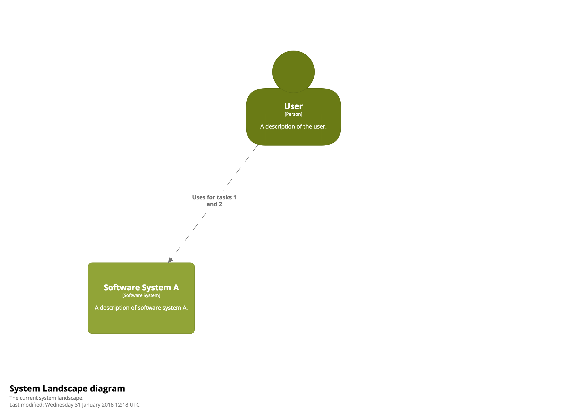
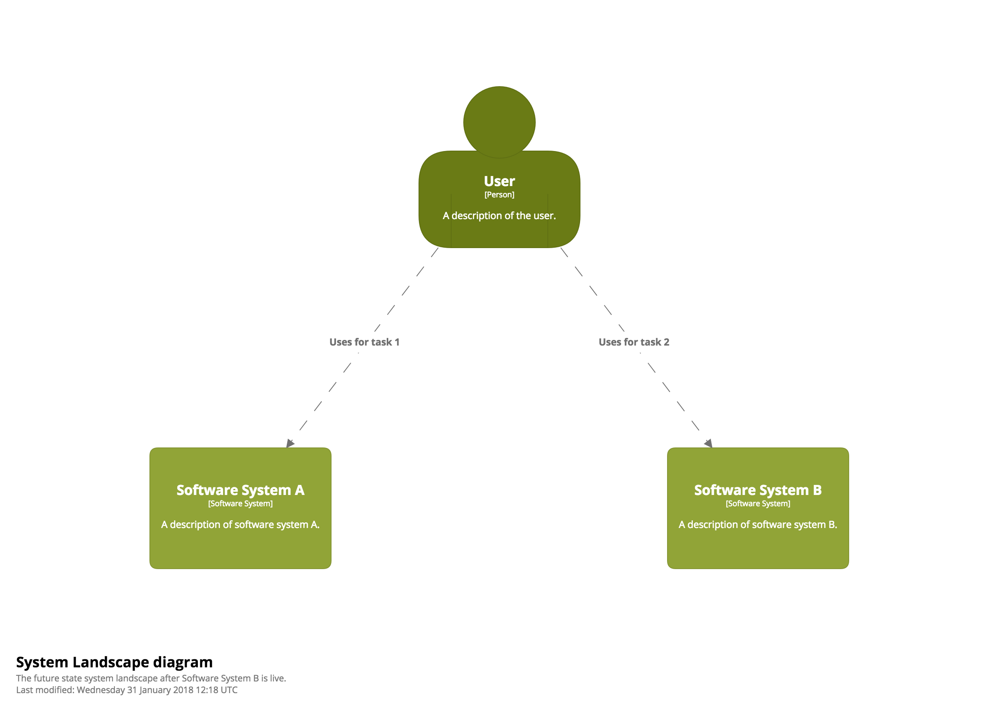

# Filtered views

A filtered view represents a view on top of another view, which can be used to include or exclude specific elements and/or relationships, based upon their tag. The benefit of using filtered views is that element and relationship positions are shared between the views.

Filtered views can be created on top of static views only; i.e. System Landscape, System Context, Container and Component views.

## Example

As an example, let's imagine an organisation where a User uses Software System A for tasks 1 and 2.



And, in the future, Software System B will be introduced to fulfil task 2.



With Structurizr for Java, you can illustrate this by defining a single context diagram with two filtered views on top; one showing the current state and the other showing future state.

```java
Person user = model.addPerson("User", "A description of the user.");
SoftwareSystem softwareSystemA = model.addSoftwareSystem("Software System A", "A description of software system A.");
SoftwareSystem softwareSystemB = model.addSoftwareSystem("Software System B", "A description of software system B.");
softwareSystemB.addTags(FUTURE_STATE);

user.uses(softwareSystemA, "Uses for tasks 1 and 2").addTags(CURRENT_STATE);
user.uses(softwareSystemA, "Uses for task 1").addTags(FUTURE_STATE);
user.uses(softwareSystemB, "Uses for task 2").addTags(FUTURE_STATE);

ViewSet views = workspace.getViews();
SystemLandscapeView systemLandscapeView = views.createSystemLandscapeView("SystemLandscape", "An example System Landscape diagram.");
systemLandscapeView.addAllElements();

views.createFilteredView(systemLandscapeView, "CurrentState", "The current system landscape.", FilterMode.Exclude, FUTURE_STATE);
views.createFilteredView(systemLandscapeView, "FutureState", "The future state system landscape after Software System B is live.", FilterMode.Exclude, CURRENT_STATE);
```

In summary, you create a view with all of the elements and relationships that you want to show, and then create one or more filtered views on top, specifying the tags that you'd like to include or exclude.

See [FilteredViews.java](https://github.com/structurizr/java/blob/master/structurizr-examples/src/com/structurizr/example/FilteredViews.java) for the full code, and [https://structurizr.com/share/19911](https://structurizr.com/share/19911) for the diagram.