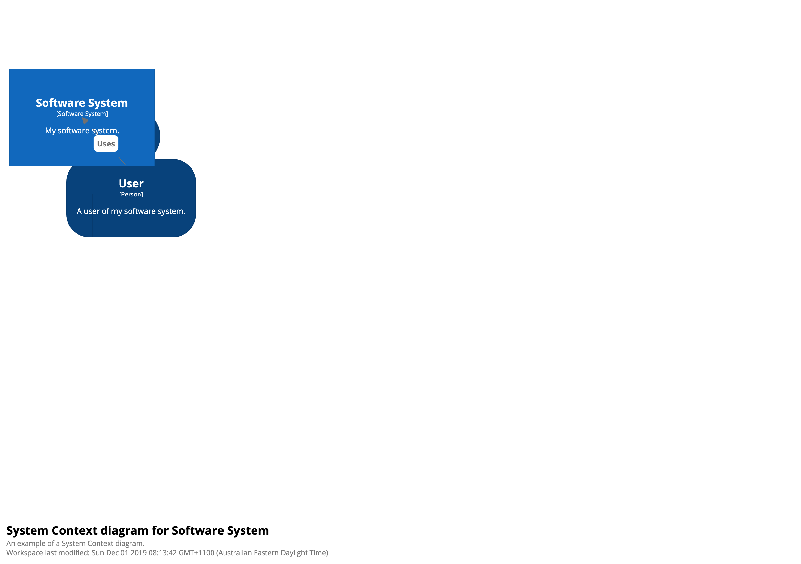
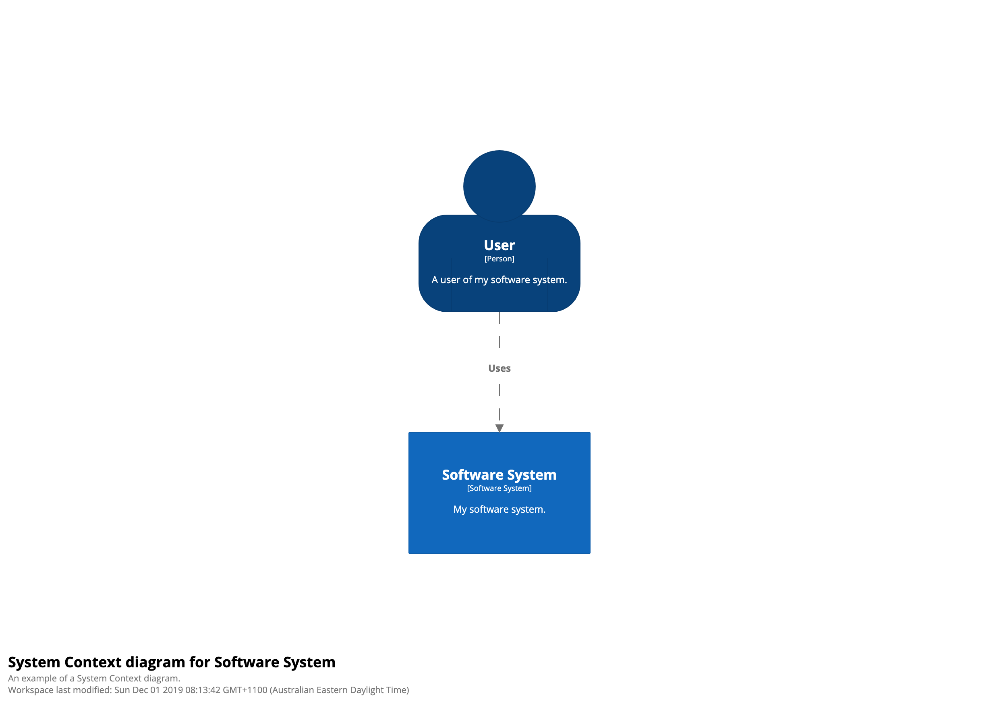
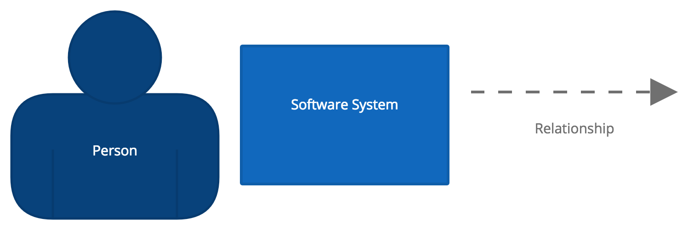

# Getting started

Here is a quick overview of how to get started with Structurizr for Java so that you can create a software architecture model as code. You can find the code at [GettingStarted.java](https://github.com/structurizr/java/blob/master/structurizr-examples/src/com/structurizr/example/GettingStarted.java) and the live example workspace at [https://structurizr.com/share/25441](https://structurizr.com/share/25441).

> See the [java-quickstart project](https://github.com/structurizr/java-quickstart) for a quick and simple way to get started with Structurizr for Java. 

For more examples, please see [structurizr-examples](https://github.com/structurizr/java/tree/master/structurizr-examples/src/com/structurizr/example).

## 1. Dependencies

The Structurizr for Java binaries are hosted on [Maven Central](https://repo1.maven.org/maven2/com/structurizr/) and the dependencies for use with Maven, Ivy, Gradle, etc are as follows.

Name                                     | Description
---------------------------------------- | ---------------------------------------------------------------------------------------------------------------------------
com.structurizr:structurizr-client:1.11.0 | The Structurizr API client library.

## 2. Create a Java program

The software architecture model is going to be created by a short Java program, so we'll need to start by creating a new Java class, with a ```main``` method as follows:

```java
public class GettingStarted {

    public static void main(String[] args) throws Exception {
       // all of the Structurizr code will go here
    }

}
```

## 3. Create a model

The first step is to create a workspace in which the software architecture model will reside.

```java
Workspace workspace = new Workspace("Getting Started", "This is a model of my software system.");
Model model = workspace.getModel();
```

Now let's add some elements to the model to describe a user using a software system.

```java
Person user = model.addPerson("User", "A user of my software system.");
SoftwareSystem softwareSystem = model.addSoftwareSystem("Software System", "My software system.");
user.uses(softwareSystem, "Uses");
```

## 4. Create some views

With the model created, we need to create some views with which to visualise it.

```java
ViewSet views = workspace.getViews();
SystemContextView contextView = views.createSystemContextView(softwareSystem, "SystemContext", "An example of a System Context diagram.");
contextView.addAllSoftwareSystems();
contextView.addAllPeople();
```

## 5. Add some colour and shapes

Optionally, elements and relationships can be styled by specifying colours, sizes and shapes.

```java
Styles styles = views.getConfiguration().getStyles();
styles.addElementStyle(Tags.SOFTWARE_SYSTEM).background("#1168bd").color("#ffffff");
styles.addElementStyle(Tags.PERSON).background("#08427b").color("#ffffff").shape(Shape.Person);
```

## 6. Upload to Structurizr

Structurizr provides a web API to get and put workspaces, and an API client is provided by the ```StructurizrClient``` class.

```java
StructurizrClient structurizrClient = new StructurizrClient("key", "secret");
structurizrClient.putWorkspace(25441, workspace);
```

> In order to upload your model to Structurizr using the web API, you'll need to [sign up for free](https://structurizr.com/signup) to get your own API key and secret. See [Structurizr - Workspaces](https://structurizr.com/help/workspaces) for information about finding your workspace ID, API key and secret.

## 7. Open the workspace in Structurizr

Once you've run your program to create and upload the workspace, you can now sign in to your Structurizr account, and open the workspace from [your dashboard](https://structurizr.com/dashboard). The result should be a diagram like this:



By default, Structurizr does not auto-layout your diagram elements. The diagram layout can be modified by dragging the elements around the diagram canvas in the diagram editor, and the layout saved using the "Save workspace" button. See [Structurizr - Help - Diagram editor](https://structurizr.com/help/diagram-editor) for more information. 



A diagram key is automatically generated based upon the styles in the model. Click the "i" button on the toolbar (or press the 'i' key) to display the diagram key.



When you upload a new version of the same workspace, the Structurizr client will try to retain the diagram layout information. See [API client](api-client.md) for more details.
